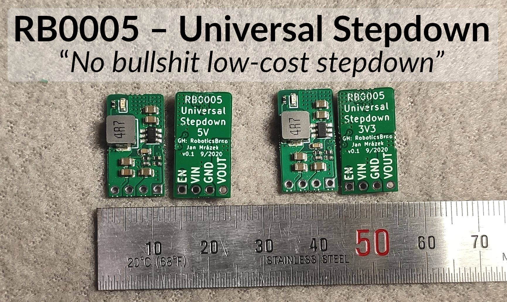

# RB0005 – Universal Stepdown

Most of our projects at RoboticsBrno are powered either by Li-ion cells or 12V
power sources. However, most of our servos and boards require either 5V or 3V3
power source.

We used to buy cheap stepdown modules from Aliexpress to do the job. They are
inexpensive but their performance is questionable. Also, it is always a
surprise what you get in the envelope – some batches of them operate better,
some of them worse. One day, we decided to stop wasting our time with
poor-performing modules and we designed our own custom module – the RB0005
Universal Stepdown.

It is a simple and low-cost design based on the
[SY8105](https://file.remont-aud.net/baza/dc_dc/data/SY8105.pdf). And it gets
the job done – see the evaluation of our design below. You can also look at our
design on the [project
repository](https://github.com/RoboticsBrno/RB0005-UniversalStepDown).

## What does the module offer?

- there are two versions – 5V and 3.3V fixed output
- input voltage up to 18 V
- continuous load: 3 A (without cooling)/4 A (with cooling)
- pin compatible with 7805 linear voltage regulator and most of the Chinese modules
- has an enable pin (pull low to disable the module)
- small factor 10.5×19.5 mm
- low price: ~3 USD
- you know what to expect – we provide measurements of the module performance
    - **see the performance of [the 5V version](https://roboticsbrno.github.io/RB0005-UniversalStepDown/eval5v/index.html)**
    - **see the performance of [the 3V3 version](https://roboticsbrno.github.io/RB0005-UniversalStepDown/eval3v/index.html)**
    - **see the performance of [the 5V version v2](https://roboticsbrno.github.io/RB0005-UniversalStepDown/eval5v/eval5v_v2)

## What we do not provide?

- high-end, precision solution
    - we do not focus on incredibly high module efficiency
    - we do not focus on being low-noise

## FAQ

#### Why the "RB0005" prefix?

To quickly distinguish our projects at
[RoboticsBrno](https://github.com/RoboticsBrno/), e.g., when ordering, we
decided to give a each project a unique code.

#### Why is there no adjustable version?

We aim for usability. Usually, you need to lower your voltage to 5 V (servos) or
3.3 V (powering MCU) in DIY robotics. Having an adjustable version increases
the chances of misconfiguration.

#### Why should I use your module instead of $1 module from Aliexpress?

Well, it depends on your needs. If you need a certain level of reliability, it
might be beneficial to know what to expect from your device. With our stepdown,
you know it: see [evaluation of the 5V
version](https://roboticsbrno.github.io/RB0005-UniversalStepDown/eval5v/index.html)
or the [the 3V3
version](https://roboticsbrno.github.io/RB0005-UniversalStepDown/eval3v/index.html).
You could buy a module from Aliexpress and measure it by yourself. However, that
is laborious and you cannot be sure that you will get the same-performing module
when you order it again.

## Licence

[RB0005 – Universal
Stepdown](https://roboticsbrno.github.io/RB0005-UniversalStepDown/) by [Jan
Mrázek](https://honzamrazek.cz) is licensed under [CC BY-NC-SA
4.0 ](https://creativecommons.org/licenses/by-nc-sa/4.0).

